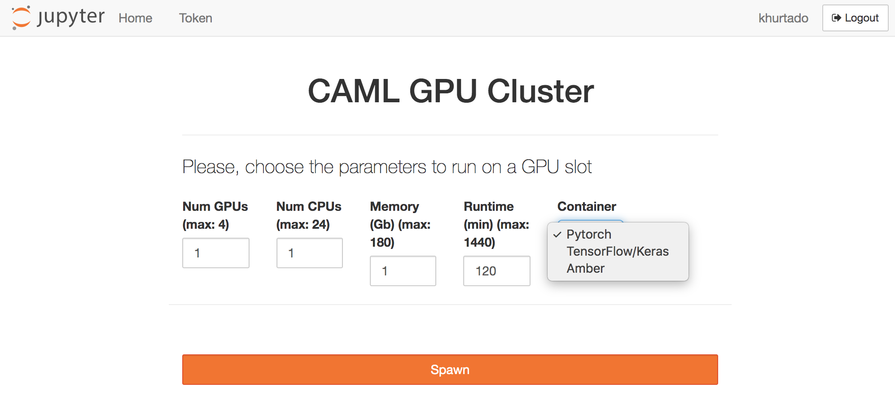

# NDJupyterSpawner

ND Jupyter spawner

```
pip install git+https://github.com/NDCMS/ndjupyterspawner
```

Add lines in jupyterhub_config.py for the spawner, i.e.:

```
   c.JupyterHub.spawner_class = 'ndspawner.NDSpawner'
```
The static form will set the following variables:

- req_gpus: Number of GPUs
- req_nprocs: Number of CPUs
- req_memory: Requested Memory (GB) 
- req_runtime: Maximum WallClocktime (in minutes) allowed for the job 
- req_singularityimage: Singularity image (located in CVMFS)

which can be used by the condor spawner like this: 

```
c.CondorSpawner.batch_script = '''
Executable = /bin/sh
request_memory = {req_memory} Gb
request_cpus = {req_nprocs}
request_gpus = {req_ngpus}
Arguments = \"-c 'exec {cmd} --ip=0.0.0.0'\"
Remote_Initialdir = {homedir}
ShouldTransferFiles = False
PeriodicRemove = (JobStatus == 1 && NumJobStarts > 1) || ( CurrentTime - JobCurrentStartDate > {req_runtime} * 60 )
+SingularityImage = "{req_singularityimage}"
Queue
'''
```

